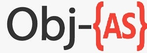

# Objective-ActionScript 3.0
<p>A Small Extension language inspired by ObjC</p>
<p>the language's propuse is to reduce the time for things like classes or interfaces by making them short(e.g from public interface to @interface makeing it short and understandable)
<br>

<br>
##### ⚠️Warning:This project will not be big anytime time soon since it's a project made with the porpuse of learning but still usable

### code exmaple:

```
@startPackage

import flash.display.Sprite;

class Main extends Sprite{
    public function Main(){
        
    }
}


@endPackage
```

## New Keywords

`@implementation -> public class`
<br>
`@interface -> public intereface`
```
[Class Action] ->
var objas_Class = new Class(); //automaticlly creates a variable with the 'objas_' prefix 
objas_Class.Action();
```

how to compile:
#### Windows(MinGW)
`ming32-make`
#### Unix(Tested yet)
`make`
